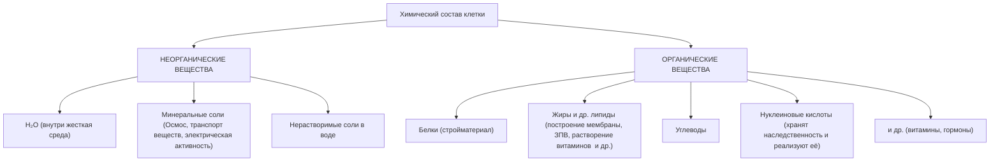

# Цитология

1839-1858гг - открытие клеточной теории (Шванн, Шлейден, Вирхофф)

```mermaid
graph TD
    A[Химический состав клетки] --> B["НЕОРГАНИЧЕСКИЕ ВЕЩЕСТВА"]
    A --> C["ОРГАНИЧЕСКИЕ ВЕЩЕСТВА"]
    B --> D["H₂O (внутри жесткая среда)"]
    B --> E["Минеральные соли (Осмос, транспорт веществ, электрическая активность)"]
    B --> F["Нерастворимые соли в воде"]
    C --> G["Белки (стройматериал)"]
    C --> H["Жиры и др. липиды (построение мембраны, ЗПВ, растворение витаминов  и др.)"]
    C --> I["Углеводы"]
    C --> J["Нуклеиновые кислоты (хранят наследственность и реализуют её)"]
    C --> K["и др. (витамины,  гормоны)"]
```
