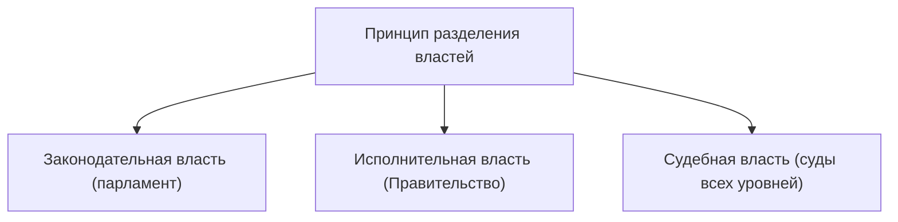

# Политическая среда

## Понятие

**   *Родовой признак** — группа понятий, которые относятся к искомому понятию.
**   *Видовые признаки** — черты, которые отличают искомое понятие от других в группе.

## Власть

**Власть** — это способность, возможность, право одной стороны влиять на поведение другой стороны вне зависимости от того, готова ли последняя к сотрудничеству.

**Власть** — это механизм организации и регулирования совместной деятельности.

### Источники власти

**.  1Сила** — физическое воздействие или угроза такового.
**.  2Авторитет** — добровольное признание превосходства одного лица над другим.
**.  3Закон** — общепризнанное правило.

## Политическая власть

**Политическая власть** — это способность одного человека или группы лиц контролировать поведение граждан и общества в целом для решения общенациональных или государственных задач.

**Политика** — деятельность, связанная с получением, использованием и удержанием человеком и другими социальными группами политической власти в целях решения вопросов общественной и государственной жизни.

### Признаки политической власти

.1 Распространяется на общество (граждан).
.2 Только ей принадлежит право применять силу.
.3 Центр принятия решений.
.4 Использование любых средств.
.5 Действует на основании права от имени всех.

**> Легальность** (не путать с **Легитимностью** — поддержкой, одобрением).

## Государство и форма государства

**Государство** — это организация политической власти, осуществляющая управление обществом и обеспечивающая в нём порядок и стабильность.

### Теории возникновения государства

**   *Теологическая**: государство создано Богом; правители подчиняются божественной воле.
**   *Патриархальная**: государство выросло из семьи; подданные относятся к правителю как дети к отцу.
**   *Теория насилия**: государство создаётся в процессе завоевания для подчинения побеждённых.
**   *Органическая**: государство — это организм, образовавшийся в результате естественного отбора: низшие классы — обеспечение жизнедеятельности, высшие — оборона и безопасность.
**   *Классовая**: государство — результат экономического развития общества и продукт классовой борьбы; орудие в руках господствующего класса.
**   *Договорная/естественно-правовая**: государство — результат договора (общественного договора) между людьми о защите их естественных прав.

### Признаки государства

.1 Границы, определённая территория.
.2 Народ, нация.
.3 Система законов.
.4 Органы власти.
.5 Налоги.
.6 Государственные символы.
.7 Монополия на легитимное насилие (только у государства).
**.  8Суверенитет**:
    **   *Внутренний** — это верховенство государственной власти внутри страны.
    **   *Внешний** — это независимость одного государства от других.

