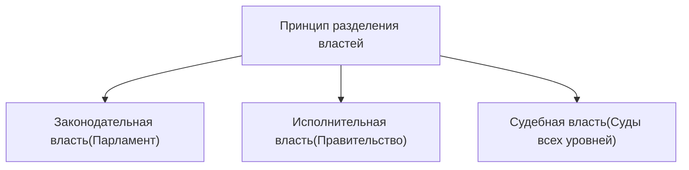

# Политическая среда

## Понятие

*   **Родовой признак** — группа понятий, которые принадлежат искомому понятию.
*   **Видовые признаки** — черты, которые выделяют искомое понятие от других в группе.

## Власть

**Власть** — это способность, возможность, право одной стороны повлиять на поведение другой стороны вне зависимости от того, готово к сотрудничеству последняя.

**Власть** — это механизм организации и регулирование совместной деятельности.

### Источники власти

1.  **Сила** — физическое взаимодействие или угроза таковой.
2.  **Авторитет** — добровольное признание превосходства одного лица над другим.
3.  **Закон** — общепризнанное правило.

## Политическая власть

**Политическая власть** — это способность одного человека или группы лиц контролировать поведение граждан, общества в целом для общенациональных или государственных задач.

**Политика** — деятельность, связанная с получением, использованием и удержанием человеком и другими социальными группами политической власти в целях решения вопросов общественной и государственной жизни.

### Признаки политической власти

1.  Распространяется на общество (граждане).
2.  Только ей принадлежит право использовать силу.
3.  Центр принятия решения.
4.  Использование любых средств.
5.  Действует на основе права от имени всего.

> **Легальность** (не путать с **Легитимностью** — поддержанность, одобренность).

## Государство и форма государства

**Государство** — это организация политической власти, осуществляющая управление обществом и обеспечивающая в нем порядок и стабильность.

### Теории возникновения государства

*   **Теологическая**: Государство сотворено богом; правители подчинены божественной воле.
*   **Патриархальная**: Государство выросло из семьи; подданные относятся к правителю как дети к отцу.
*   **Теория насилия**: Государство создаётся в процессе завоевания для подчинения побеждённых.
*   **Органическая**: Государство — это организм, образовавшийся в результате естественного отбора: низшие классы — обеспечение жизнедеятельности, высшие — оборона и безопасность.
*   **Классовая**: Государство — результат экономического развития общества и продукт классовой борьбы; орудие в руках господствующего класса.
*   **Договорная/естественно-правовая**: Государство — продукт договора (социального контракта) между людьми о защите их естественных прав.

### Признаки государства

1.  Границы, определённая территория.
2.  Народ, нация.
3.  Система законов.
4.  Органы власти.
5.  Налоги.
6.  Государственные символы.
7.  Монополия на легитимное насилие (только государство).
8.  **Суверенитет**:
    *   **Внутренний** — это верховенство власти государства внутри страны.
    *   **Внешний** — это независимость одного государства от других.
